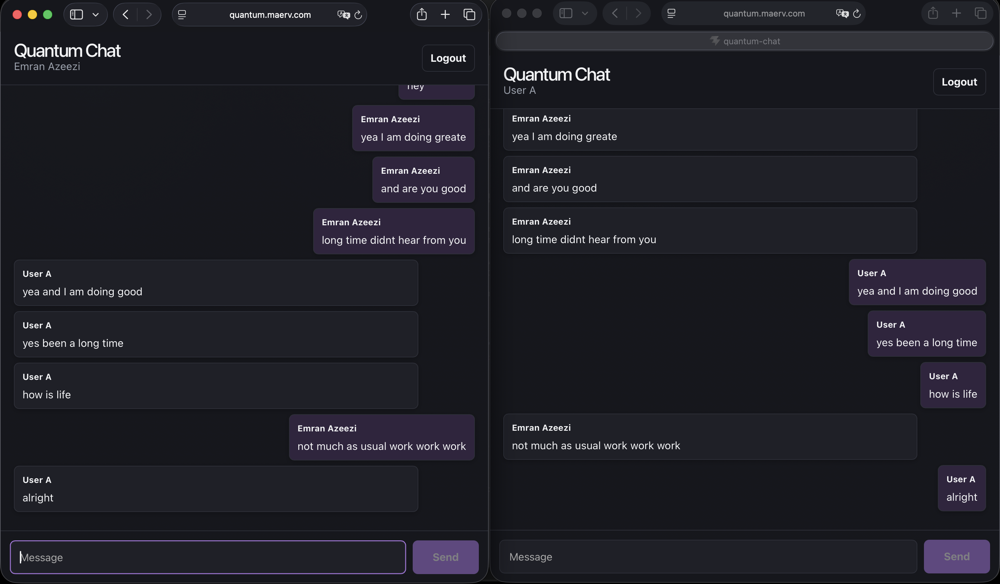
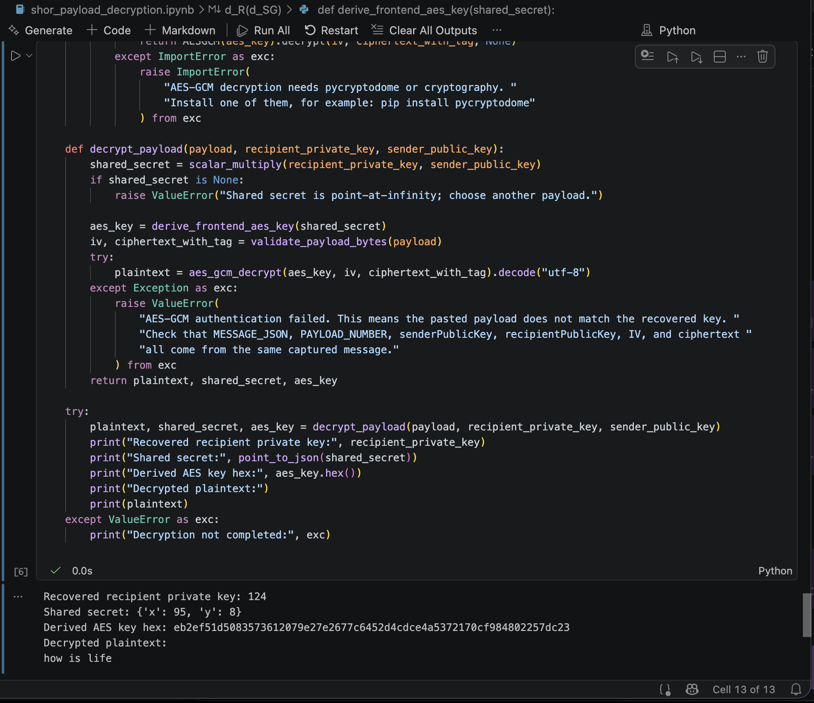

# Quantum Chat

Quantum Chat is an educational cryptography and quantum cryptanalysis project that connects a working encrypted chat application with a step-by-step demonstration of Shor’s algorithm for the Elliptic Curve Discrete Logarithm Problem (ECDLP).

The project first shows how simplified elliptic-curve encrypted communication is created in practice. The React/Vite frontend and Flask/Socket.IO backend allow users to generate elliptic-curve key pairs, derive shared secrets with ECDH, encrypt messages with AES-GCM, sign message envelopes, exchange encrypted messages in real time, and capture encrypted payloads for analysis.

The accompanying notebooks then explain and demonstrate how Shor’s algorithm applies to the elliptic-curve discrete logarithm setting. They cover the hidden-relation function, quantum registers, phase kickback, Quantum Phase Estimation (QPE), the Quantum Fourier Transform (QFT), measurement, classical recovery of the private scalar, shared-secret reconstruction, AES key derivation, and decryption of a captured encrypted payload.

Together, the chat application and notebooks form an end-to-end educational workflow: encrypted communication is generated, a payload is captured, the simplified elliptic-curve private scalar is recovered through the theoretical Shor/ECDLP process, and the original message is decrypted.

The project also includes Docker Compose deployment, GitHub Actions CI/CD, Cloudflare Tunnel access, packet-capture analysis, and educational notebook material that links practical encrypted messaging with the mathematical foundations of quantum cryptanalysis.

> **Educational Notice**
>
> This project is intended solely for education and demonstration. The elliptic curve, key sizes, and signature implementation are intentionally simplified and are **not** suitable for production cryptography. It does not demonstrate a practical attack against modern cryptographic systems, standardized elliptic curves, HTTPS, or production messaging applications.

## Project Workflow

```text
1. Users exchange encrypted chat messages
   |
   v
2. The application generates encrypted message envelopes
   |
   v
3. A network payload is captured
   |
   v
4. shor_ecc_theory.ipynb explains the theoretical attack
   |
   v
5. shor_payload_decryption.ipynb recovers the educational private scalar
   |
   v
6. The shared secret and AES-GCM key are reconstructed
   |
   v
7. The captured ciphertext is decrypted and verified
```

The chat application demonstrates how encrypted messages are generated, exchanged, and transported between users. The notebooks provide both the theoretical background and the practical educational cryptanalysis, showing how recovery of the educational private scalar enables reconstruction of the shared secret and decryption of the captured payload.

## Skills Demonstrated

- Quantum computing concepts, including Shor's algorithm for the Elliptic Curve Discrete Logarithm Problem (ECDLP)
- Elliptic Curve Cryptography concepts, including ECC and ECDH
- Private-scalar recovery against an intentionally small educational curve
- Captured ciphertext parsing, key reconstruction, and AES-GCM decryption
- Full-stack web development with React, Flask, and Socket.IO
- Realtime message delivery and structured encrypted payload design
- Docker and Docker Compose for local and production environments
- GitHub Actions CI/CD with linting, builds, dependency checks, and image publishing
- Containerized deployment through GitHub Container Registry
- Cloudflare Tunnel setup for restricted-network access
- Network traffic analysis with tcpdump and Wireshark
- Technical documentation and reproducible project setup

## Screenshots

[](docs/images/login%20page.png)

[](docs/images/texting_between_users.png)

[](docs/images/wireshark%20payload.png)

[](docs/images/decryption%20verification.png)

[](docs/images/decryption.png)

## System and Cryptographic Workflow 

```text
Browser
└── React Application
    |
    | Local cryptography
    | • ECC key generation
    | • ECDH shared-secret derivation
    | • AES-GCM encryption
    | • Message signing
    | • Signature verification
    v
Encrypted message envelope
    |
    | HTTPS / Socket.IO
    v
Cloudflare Tunnel (public route)
    |
    v
Nginx (Frontend container)
    |
    | Serves React application
    | Proxies /api and /socket.io
    v
Flask + Socket.IO (Backend container, :7070)
    |
    | Validates payload structure
    | Stores users and messages (in memory)
    | Relays encrypted envelopes
    v
Recipient Browser
└── React Application
    |
    | Local signature verification
    | Local ECDH key derivation
    | Local AES-GCM decryption
    v
Displayed message
```

For local development, the frontend is available at `http://localhost:5173`. In production, Cloudflare Tunnel routes public traffic to the frontend container without publishing application ports on the server. Cryptographic operations run in each user's browser; the backend validates and relays encrypted envelopes but does not decrypt message contents.

## Repository Structure

```text
.github/workflows/        CI and deployment workflows
backend/                  Flask and Socket.IO backend
frontend/                 React/Vite frontend
docs/                     Supporting technical walkthroughs
.env.example              Safe placeholder environment file
docker-compose.yml        Local Docker Compose configuration
compose.prod.yml          Production Docker Compose configuration
DEPLOYMENT.md             Server deployment and rollback guide
shor_ecc_theory.ipynb     Shor/ECDLP theory notebook
shor_payload_decryption.ipynb
                           Payload parsing and decryption workflow
```

## Configuration

Copy the example environment file when configuring local or production-specific settings:

```bash
cp .env.example .env
```

Do not commit `.env`. It is ignored by Git.

Important variables:

```dotenv
CLOUDFLARED_TOKEN=replace_with_your_tunnel_token
ALLOWED_ORIGINS=http://localhost:5173,http://127.0.0.1:5173
IMAGE_BASE=ghcr.io/your-github-user/your-repository
IMAGE_TAG=latest
```

For production, set `ALLOWED_ORIGINS` to your public application URL:

```dotenv
ALLOWED_ORIGINS=https://chat.example.com
```

## Run Locally With Docker

Prerequisites:

- Docker Engine
- Docker Compose plugin

Start the backend and frontend:

```bash
docker compose up --build backend frontend
```

Open:

```text
http://localhost:5173
```

Stop:

```bash
docker compose down
```

## Run Locally Without Docker

Backend:

```bash
cd backend
python -m venv .venv
source .venv/bin/activate
python -m pip install -r requirements.txt
python app.py
```

Frontend:

```bash
cd frontend
npm ci
npm run dev
```

Open:

```text
http://localhost:5173
```

## Quality Checks

Run these before pushing:

```bash
cd frontend
npm audit --omit=dev --audit-level=high
npm run lint
npm run build
```

```bash
python3 -m pip check
python3 -m py_compile backend/app.py
```

```bash
CLOUDFLARED_TOKEN=ci-placeholder docker compose config --quiet
CLOUDFLARED_TOKEN=ci-placeholder \
ALLOWED_ORIGINS=https://chat.example.com \
IMAGE_BASE=ghcr.io/example/quantum-chat \
IMAGE_TAG=ci \
docker compose -f compose.prod.yml config --quiet
```

## CI/CD

GitHub Actions validates the frontend, backend, Compose files, dependency state, and Docker builds on pull requests and pushes to `main`. CI uses GitHub-hosted runners so public pull requests do not execute code on a private self-hosted machine.

After CI succeeds on `main`, the deployment workflow publishes backend and frontend images to GitHub Container Registry, tags them with the tested commit SHA, connects to the server over SSH, pulls the tested images, and restarts the production Compose stack.

## Production Deployment

Production deployment is optional. It is useful when the app cannot be reached from a restricted network because firewall rules block the required ports, or when a public route is needed for packet-capture analysis.

The deployment uses Cloudflare Tunnel to route public traffic to the frontend container without opening inbound application ports. The frontend nginx container then proxies `/socket.io/` and `/api/` traffic to the backend on port `7070`.

See [DEPLOYMENT.md](DEPLOYMENT.md) for the complete server setup, GitHub environment secrets, Cloudflare Tunnel configuration, deployment process, and rollback workflow.

## Packet Capture

The project includes an authorized packet-capture workflow for inspecting encrypted backend traffic with tcpdump and Wireshark. The capture point is the internal frontend-to-backend traffic on port `7070`, after Cloudflare Tunnel has delivered requests into the Compose network.

See [docs/packet_capture.md](docs/packet_capture.md) for the complete packet-capture and Wireshark extraction workflow.

## Notebooks

- [shor_ecc_theory.ipynb](shor_ecc_theory.ipynb): explains the ECDLP/Shor's algorithm workflow on the educational curve.
- [shor_payload_decryption.ipynb](shor_payload_decryption.ipynb): parses captured encrypted payloads and walks through private-scalar recovery and AES-GCM payload decryption.

## Security Notes

- This application is not a production encryption system.
- The educational ECC parameters are intentionally small.
- Packet capture is included only for authorized demonstrations on systems you own or are authorized to inspect.
- Production CORS is controlled by `ALLOWED_ORIGINS`; set it to your public application URL.
- Store deployment credentials only in GitHub environment secrets or server-side `.env` files.

## Reviewer References

- [DEPLOYMENT.md](DEPLOYMENT.md)
- [docs/packet_capture.md](docs/packet_capture.md)
- [compose.prod.yml](compose.prod.yml)
- [.github/workflows/ci.yml](.github/workflows/ci.yml)
- [.github/workflows/deploy.yml](.github/workflows/deploy.yml)
- [backend/app.py](backend/app.py)
- [frontend/src/educationalCrypto.js](frontend/src/cryptoDemo.js)
